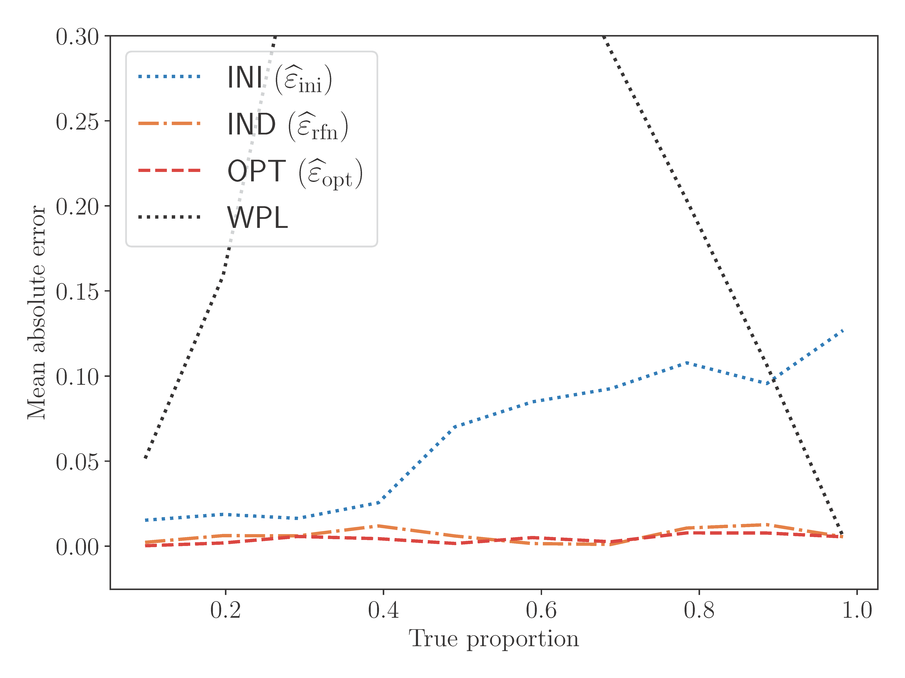
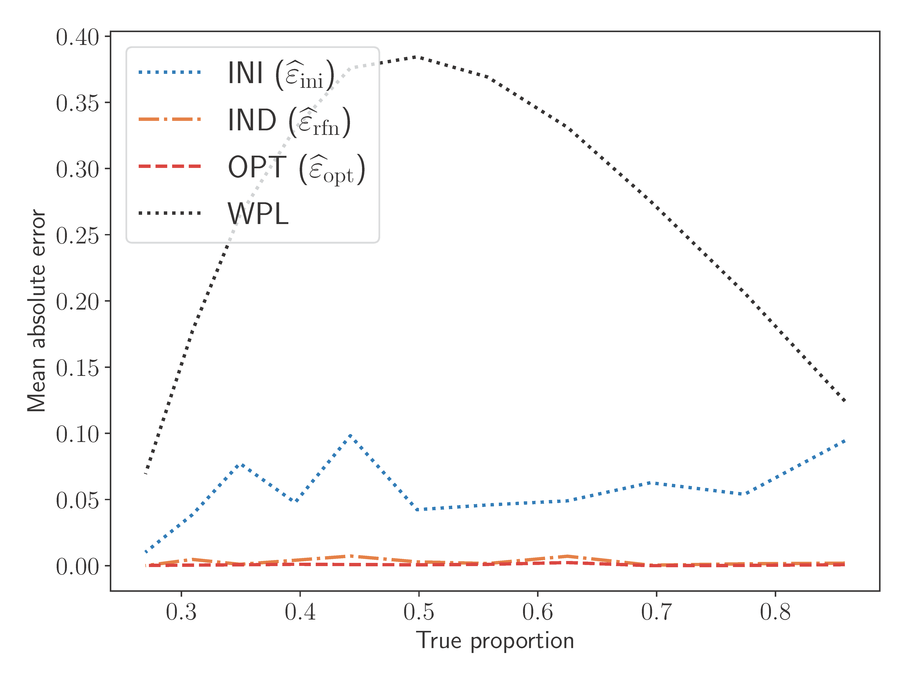
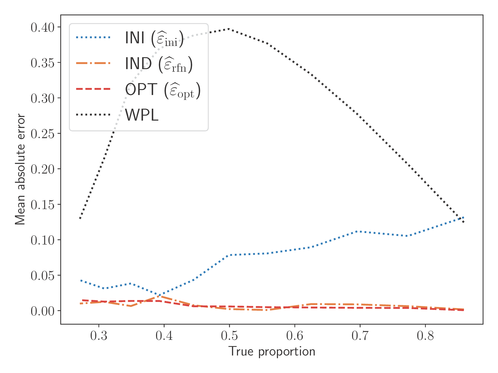
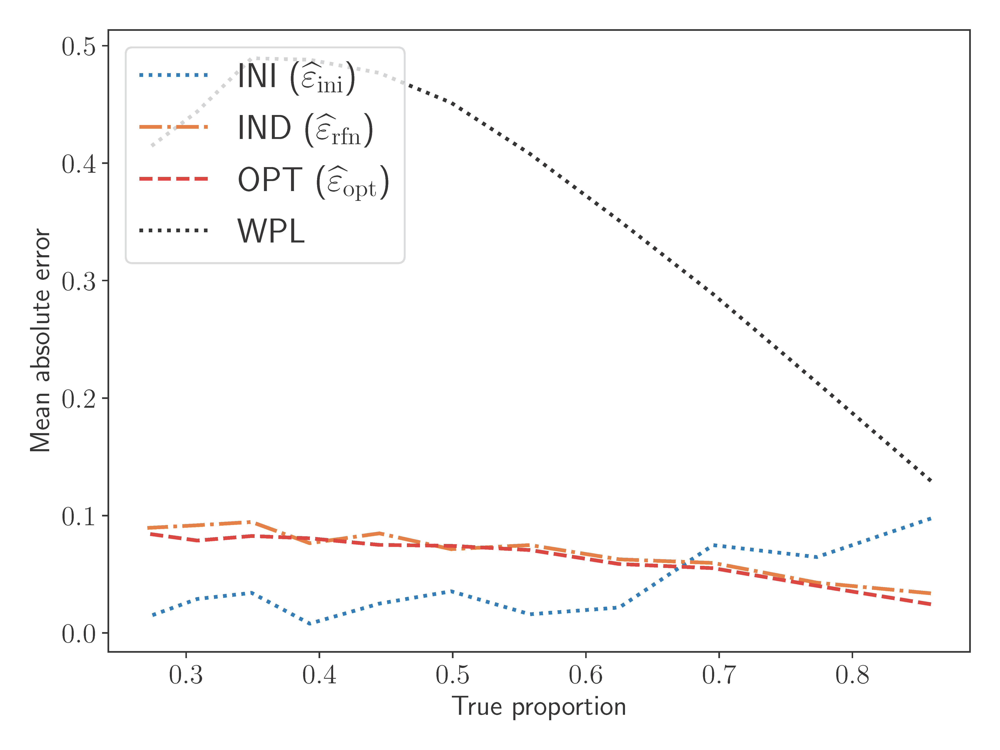

# Optimal Estimation of Watermark Proportions

This repository accompanies the paper:

> **Optimal Estimation of Watermark Proportions in Hybrid AI–Human Texts**  
> *(link coming soon)*

If you find this code useful, please cite:

```bibtex
@article{li2025optimal,
  title   = {Optimal Estimation of Watermark Proportions in Hybrid {AI}–Human Texts},
  author  = {Li, Xiang and Wen, Garret and He, Weiqing and Wu, Jiayuan and Long, Qi and Su, Weijie J},
  journal = {arXiv preprint arXiv:????.?????},
  year    = {2025}
}
````

---

## Key Idea

We estimate the watermark proportion $\epsilon$ with *minimum variance* by:

1. **Leveraging fully watermarked pivotal statistics** as auxiliary data.
2. **Solving a fixed-point equation**—either by simple iteration or a numerical solver.

These two ingredients reduce estimator variance while remaining computationally light.

```python
import numpy as np
from scipy.optimize import minimize

def refined_estimator_optimal_weight(observed_Y, cdf, use_iterative=False, N0=500):
    """
    Variance-optimal estimator of ε.
    observed_Y : mixed pivotal statistics  (shape = n_tokens,)
    cdf        : fully watermarked statistics
    """
    # KDE for watermark distribution
    bin_edges, density = histogram_density(cdf, N=N0)

    # Evaluate densities for three populations
    f0 = evaluate_density(np.random.uniform(0, 1, 10**6), bin_edges, density)  # pure null
    fp = evaluate_density(cdf, bin_edges, density)         # pure watermark
    fy = evaluate_density(observed_Y, bin_edges, density)         # mixture

    # Fixed-point map ε ↦ T(ε)
    def T(eps):
        E0 = np.mean((1 - f0) / ((1 - eps) + eps * f0))
        Ep = np.mean((1 - fp) / ((1 - eps) + eps * fp))
        EY = np.mean((1 - fy) / ((1 - eps) + eps * fy))
        return np.clip((E0 - EY) / (E0 - Ep), 1e-3, 1.0)

    # Solve ε = T(ε)
    if use_iterative:
        eps = 0.5
        for _ in range(1000):
            new = T(eps)
            if abs(new - eps) < 1e-6: break
            eps = new
    else:
        eps0 = 0.9
        for _ in range(20): eps0 = g(eps0)        # warm-start
        res  = minimize(lambda e: abs(e[0] - T(e[0])), [eps0],
                        bounds=[(0,1)], tol=1e-9)
        eps  = res.x[0]
    return eps
```

After collecting pivotal statistics into an array `Ys`, estimate $\epsilon$ via

```python
epsilon_hat = refined_estimator_optimal_weight(Ys, cdf)
```

Two simpler naive estimators are in **`estimator.py`**, and we include **WPL**
([https://github.com/XuandongZhao/llm-watermark-location](https://github.com/XuandongZhao/llm-watermark-location)) as the baseline.

---

## Directory Overview

```text
.
├── LLM_codes/           # Experiments on large language models
├── simulation_codes/    # Synthetic simulations
└── README.md            # This file
```
---

## Simulation Experiments

The simulation scripts are fully self-contained. Simply run each Python file to reproduce the corresponding results.

For example, to generate the CDF and tail behavior results for the Gumbel-max watermark, run:

```bash
cd simulation_code
python estimation_gumbel.py
```

---
## LLM Experiment Pipelines

Change into the experiment folder first:

```bash
cd LLM_codes
```

### 1. Mixture Setting

Each token is watermarked independently with probability $\epsilon$.
The following command generates 10 datasets with different ground-truth $\epsilon$ values:

```bash
python Step1_mixture_generation.py \
  --method Gumbel --model facebook/opt-1.3b \
  --m 500 --T 500 --temp 1
```

To estimate ε and plot results (saved to `figs/`), run:

```bash
python Step2_mixture_estimation.py \
  --method Gumbel --model facebook/opt-1.3b \
  --m 500 --T 500 --temp 1
```

> **Note:** Pre-generated data in `text_data/` allow you to skip Step 1 if you just want to reproduce the following figure for the above very configuration.
<p align="center">
  
</p>

---

### 2. Modified Setting

We first generate a fully watermarked dataset, then apply random substitution, insertion, and deletion to corrupt a certain fraction of tokens.
The goal is to estimate how much of the watermark signal remains after these edits.

In Step 1, we first create the raw dataset and then produce 11 corrupted versions for each type of modification.

```bash
python Step1_modified_generation.py \
  --method Gumbel --model facebook/opt-1.3b \
  --m 500 --T 500 --temp 1
```

Based on the raw and corrupted datasets from Step 1, we can apply different estimators to compute the estimated watermark proportions by running:

```bash
python Step2_modified_estimation.py \
  --method Gumbel --model facebook/opt-1.3b \
  --m 500 --T 500 --temp 1
```
Again, you may skip Step 1 thanks to the bundled datasets.

| Substitution | Insertion | Deletion |
|--------------|-----------|----------|
|  |  |  |
